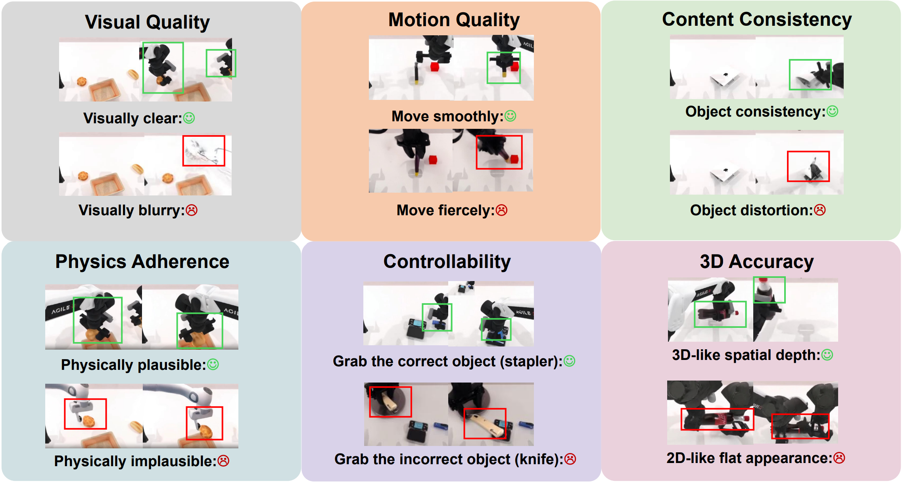
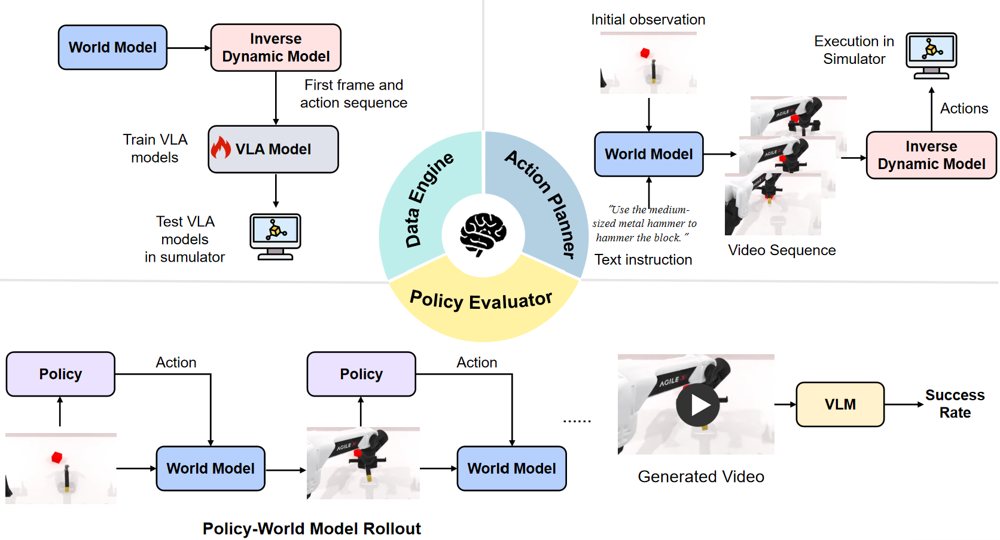

# WorldArena: A Unified Benchmark for Evaluating Perception and Functional Utility of Embodied World Models

</div>

<div align="center">


<a href="https://world-arena.ai/">
  
</a>

<a href="https://arxiv.org/abs/2602.08971">
  
</a>

<a href="https://huggingface.co/spaces/WorldArena/WorldArena">
  
</a>

<a href="https://huggingface.co/datasets/WorldArena/WorldArena_Robotwin2.0">
  
</a>

<br>
<a href="https://discord.gg/ZMrJJD55" target="_blank">
   
  <b>Discord Group</b>
</a>

<a href="./assets/WeChat.jpg" target="_blank">
   
  <b>WeChat Group</b>
</a>

</div>


## Table of Contents

- [Updates](#-updates)
- [Overview](#-overview)
- [Dataset](#-dataset)
- [Video Quality Evaluation](#-video-quality-evaluation)
- [Embodied Task Evaluation](#-embodied-task-evaluation)
- [Leaderboard](#-leaderboard)
- [Submission](#-submission)
- [Online Arena](#-online-arena)
- [Human Evaluation](#-human-evaluation)
- [Citation](#-citation)


## 📢 Updates
- [2026/03/26] WorldArena Challenge@CVPR 2026 open.
- [2026/03/20] Online arena release.
- [2026/03/06] Open for submissions.
- [2026/02/13] Code initial release.
- [2026/02/13] Leaderboard release.


## 🔍 Overview

WorldArena is a unified benchmark designed to systematically evaluate embodied world models across both **perceptual** and **functional** dimensions. WorldArena assesses models through **(1) video perception quality**, measured with sixteen metrics across six sub-dimensions; **(2) embodied task functionality**, which evaluates world models as synthetic data engines, policy evaluators, and action planners; **(3) human evaluations**, including overall quality, physics adherence, instruction following and head-to-head win rate. Furthermore, we propose **EWMScore**, a holistic metric integrating multi-dimensional performance into a single interpretable index. This work provides a framework for tracking progress toward truly functional world models in embodied AI.


## 📦 Dataset
The project builds on a curated subset of the [RoboTwin 2.0 dataset](https://huggingface.co/datasets/TianxingChen/RoboTwin2.0), a simulation framework and benchmark for bimanual robotic manipulation. We use the Clean-50 configuration of RoboTwin 2.0, which includes 50 manipulation tasks (50 episodes per task; we officially use 40 for training and 10 for testing).


## 🎬 Video Quality Evaluation
<div align="center">



</div>

Please refer to [video quality metrics](https://github.com/tsinghua-fib-lab/WorldArena/blob/main/video_quality) for implementation.

## 🤖 Embodied Task Evaluation

<div align="center">



</div>

Please refer to [embodied task](https://github.com/tsinghua-fib-lab/WorldArena/tree/main/embodied_task) for implementation.

## 🏆 Leaderboard

The official WorldArena leaderboard is hosted on HuggingFace: [](https://huggingface.co/spaces/WorldArena/WorldArena). It provides standardized evaluation results across video perception quality, embodied task functionality, and the unified EWMScore. We welcome community submissions to benchmark new embodied world models under a fair and reproducible protocol. Join us in advancing truly functional world models for embodied AI.


## 📤 Submission
Please refer to [submission](https://github.com/tsinghua-fib-lab/WorldArena/blob/main/assets/README_submission.md) for result submission of Track 1 and Track 2.

**Note: Please use the latest version of the test_dataset `(released on 2026.3.6)` for the submission!**


## 👥 Human Evaluation
Be part of shaping the future of embodied world models!  👉 **Start here:**  [Human Evaluation](https://sd64n7jjtvotb9m1apn80.apigateway-cn-beijing.volceapi.com/)

We invite you to participate in our human evaluation by providing your judgment about generated videos — it only takes a few minutes. Your feedback helps us uncover hidden failure cases and align automated metrics with real human perception. Every contribution strengthens a more trustworthy and community-driven leaderboard.


## 🙌 Acknowledgement

We acknowledge [RoboTwin 2.0](https://robotwin-platform.github.io/) for providing the dataset and simulation platform support that enables embodied task evaluation.  

We thank [VPP](https://github.com/roboterax/video-prediction-policy) for providing the IDM framework used in our embodied action planning implementation.

For video quality evaluation, WorldArena references and partially builds upon the code implementations of the following projects: [VBench](https://github.com/Vchitect/VBench), [EWMBench](https://github.com/AgibotTech/EWMBench), [WorldScore](https://github.com/haoyi-duan/WorldScore), [EvalCrafter](https://github.com/evalcrafter/EvalCrafter), [JEDI](https://github.com/oooolga/JEDi).


## 📖 Citation
```bibtex
@article{shang2026worldarena,
  title={WorldArena: A Unified Benchmark for Evaluating Perception and Functional Utility of Embodied World Models},
  author={Shang, Yu and Li, Zhuohang and Ma, Yiding and Su, Weikang and Jin, Xin and Wang, Ziyou and Jin, Lei and Zhang, Xin and Tang, Yinzhou and Su, Haisheng and others},
  journal={arXiv preprint arXiv:2602.08971},
  year={2026}
}
```
